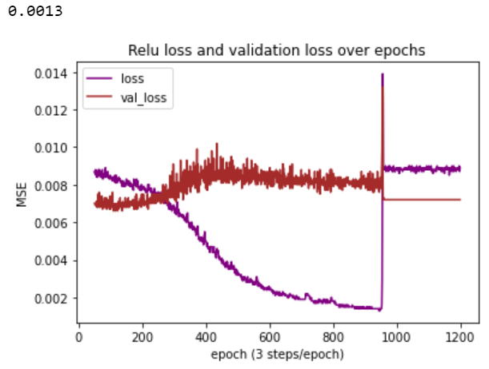
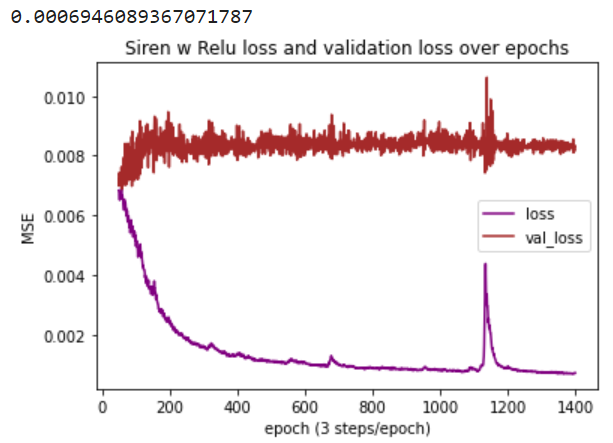

[Link to another page](./another-page.html).

# INTRODUCTION
As image colorization gives old photos a new life and dimension, it is something that has always compelled us. Hence assigning colors to black and white images is very bothersome, data scientist have come up with a solution to make it happen more easily by using artificial neural networks. Now, we want to take it to next level (more efficent and accurate) by using a recently composed and published SIREN activation function. The SIREN will be more thoroughly discussed in the next section.


The grand aim of this project is to build or reuse an image colorization neural network while using SIREN activation function instead.
SIREN is a periodic activation function described in [^sitz]. It has proven better results in fitting images, videos, audio signal, solving Poission equations etc than other existing activation functions. So, the question rose- can we use it in a neural network based model to colorize images. Furthermore, not only to use  it but will it perform better then for example much exploited _relu_ activation function.


The project is divided into three phases:
1. Experimenting with SIREN in the given Collab environment and getting acqainted with the concept.
2. Trying out b/w image colorization and trying to make it work with SIREN
3. Merging and resizing with SIREN.

The original SIREN paper github link: [SIREN](https://github.com/vsitzmann/siren)

# BACKGROUND

SIREN models use sinus as activation functions. Models build with SIREN are stable through gradient operation: if a model is trained an output, then the gradient of the output is also close from the aimed output.

This means that SIREN models trained to output an image will provide an output that also has a gradient -and laplacian- close to the aimed image.


*Comparison of the activation functions [^sitz]*

This stability of SIREN models is useful in performing operations on the output of SIREN models: the Fourier transform is compatible with SIREN models (it can be applied to the output of SIREN models), differential equations can be solved with SIREN because the derivative of functions are computed correctly through SIREN, ...

However, the training of a model using sine activation functions depends highly on the initialization of the activation functions:

$$y=sin(ax+b), a, b \in \mathbb{R}$$

If the initialization is inaccurate, the model may fail at training. The advised strategy to initialize weights is:

$$a \sim U\Big(-\dfrac{\sqrt6}{\sqrt n}, \dfrac{\sqrt6}{\sqrt n}\Big)$$

n is the number of nodes in the layer. This choice allows the result $ax+b$ to be in $[-\dfrac{\pi}{2}, \dfrac{\pi}{2}]$, and have  a normal distribution. Therefore, the initialization avoids a situation in which a learning step jumps over entire periods of the sine function.


The fundamental use of SIREN models is to store images: a model is trained to output the value of the image on one pixel from the coordinates of the pixel as input. This means that the image is stored within the model, and can be resized at will. One interesting application is to merge images together: a model is trained to output an image which gradient will be the mean of 2 images. In the paper, this experiment was successful on gray images.


*Merging of images [^sitz]*

The resulting image is realistic, since it focuses on the main elements of each image.


Another application of SIREN models is the representation of shapes: the model will store a specific shape, trying to be as realistic as possible.


*Comparison of the activation functions in shape learning [^sitz]*

We notice that SIREN results in a smoother result than other activation functions.

[^sitz]: Sitzmann, Vincent and Martel, Julien N.P. and Bergman, Alexander W. and Lindell, David B. and Wetzstein, Gordon, Implicit Neural Representations with Periodic Activation Functions, https://arxiv.org/pdf/2006.09661.pdf, 2020

# RESULTS

# Colorization

Here we represent what we have achieved with colorization.

## Reusing model

What kind of model should we use? It was a rather complicated question at first and we concentrated too much on quite complicated models such as [AIC](https://github.com/lukemelas/Automatic-Image-Colorization) and [Pix2Pix](https://github.com/affinelayer/pix2pix-tensorflow). Then we found a simple introduction to image colorization given by Emil Wallner from [emil_wallner](https://medium.com/@emilwallner/colorize-b-w-photos-with-a-100-line-neural-network-53d9b4449f8d). It also inculded advanced model that were capable of actually colorizing b/w images. It was based on _relu_ and _tanh_ activation functions. So, it was a perfect model to try out _siren_ function.

Here is the overview of the architecture of the model:

```
embed_input = Input(shape=(1000,))

#Encoder
encoder_input = Input(shape=(256, 256, 1,))
encoder_output = Conv2D(64, (3,3), activation='relu', padding='same', strides=2)(encoder_input)
encoder_output = Conv2D(128, (3,3), activation='relu', padding='same')(encoder_output)
encoder_output = Conv2D(128, (3,3), activation='relu', padding='same', strides=2)(encoder_output)
encoder_output = Conv2D(256, (3,3), activation='relu', padding='same')(encoder_output)
encoder_output = Conv2D(256, (3,3), activation='relu', padding='same', strides=2)(encoder_output)
encoder_output = Conv2D(512, (3,3), activation='relu', padding='same')(encoder_output)
encoder_output = Conv2D(512, (3,3), activation='relu', padding='same')(encoder_output)
encoder_output = Conv2D(256, (3,3), activation='relu', padding='same')(encoder_output)

#Fusion
fusion_output = RepeatVector(32 * 32)(embed_input)
fusion_output = Reshape(([32, 32, 1000]))(fusion_output)
fusion_output = concatenate([encoder_output, fusion_output], axis=3)
fusion_output = Conv2D(256, (1, 1), activation='relu', padding='same')(fusion_output)

#Decoder
decoder_output = Conv2D(128, (3,3), activation='relu', padding='same')(fusion_output)
decoder_output = UpSampling2D((2, 2))(decoder_output)
decoder_output = Conv2D(64, (3,3), activation='relu', padding='same')(decoder_output)
decoder_output = UpSampling2D((2, 2))(decoder_output)
decoder_output = Conv2D(32, (3,3), activation='relu', padding='same')(decoder_output)
decoder_output = Conv2D(16, (3,3), activation='relu', padding='same')(decoder_output)
decoder_output = Conv2D(2, (3, 3), activation='tanh', padding='same')(decoder_output)
decoder_output = UpSampling2D((2, 2))(decoder_output)

model = Model(inputs=[encoder_input, embed_input], outputs=decoder_output)
```

the `embed_input` includes information from the image classifier — the inception resnet v2, that is trained on over a million images. The more exact description of the model is given at [emil_wallner](https://medium.com/@emilwallner/colorize-b-w-photos-with-a-100-line-neural-network-53d9b4449f8d).


### Warm-up

After messing around with the [emil_wallner](https://medium.com/@emilwallner/colorize-b-w-photos-with-a-100-line-neural-network-53d9b4449f8d) original model we eventually achieved something:
- 1000 epochs with only one picture to train and test
- Train photo, test photo, result


| Train image             |  Test image     | Result image |
:-------------------------:|:-------------------------:|:------------------:
 | |

_versions necessary to make the model run in one's computer use tensorflow 1.14.0 and keras 2.1.6_
*(!pip install tensorflow==1.14.0)* *(!pip install keras==2.1.6)* *(h5py=2.10.0)*

### Implementing Siren

Then, we had to figure out a way to include or build _siren_ activation function for tensorflow and keras. Firstly, quite difficult implementations were tried but at some point it occurred that the implementation can be done quite easily:

Here is the function to initialize the first layer of the model as described in the article altough the $\omega_0=1/30$ which is different than in the article:
(In the article $\omega_0=30$ but this provided poor results. We did not figured out why but $\omega_0=1/30$ in contrary worked fine!)

```
from keras.utils.generic_utils import get_custom_objects

def siren_in(x):
    x *= 1/30
    return tf.math.sin(x)

get_custom_objects().update({'siren_in': Activation(siren_in)})
```

and here is how it looks like in the layer:

`encoder_output = Conv2D(64, (3,3), activation="siren_in", kernel_initializer=tf.keras.initializers.RandomUniform(minval=-1, maxval=1), padding='same', strides=2)(encoder_input)`

where `kernel_initializer` is for the weight initialization.

For other layers, the _siren_ could be given in such a way:

`encoder_output = Conv2D(128, (3,3), activation=tf.math.sin, kernel_initializer="he_uniform", padding='same')(encoder_output)`

where `he_uniform` is a uniform distribution $U(-\sqrt{\frac{6}{fan_{in}}},\sqrt{\frac{6}{fan_{in}}})$ (fan_in is the number of input units in the weight tensor) which is same as described in the paper.

### EMIL_WALLNER model testing

Many different combinations of activation functions were tried out but eventually three were chosen to carry out final experiments:
Let's call the models followingly:
- FULL_RELU(FR): everything is left as in the original model- only the ultimate layer's activation function is *tanh*, others are *relu*
- SIREN_RELU_SIREN(SRS): only the first and last layer are changed to have *siren* activation function
- SIREN130(S130) aka FULL_SIREN: all the layers are using *siren*

All the mentioned models proved rather satisfing results on fitting one picture. The results of fitting are represented below:

| Full_Relu(FR) |  Siren_Relu_Siren(SRS) | Siren130(S130)|
|:-------------------------:|:-------------------------:|:------------------:|
 |  |
|                          |*Final result after 1000 epochs* |               |
 | |
|                       |   *Loss from 50 to 1000 epochs*     |              |
 | |

We can see that the loss is less than ~0.002 respectively after 1000, 300 and 900 epochs. This is the first implication that _siren_ combined with _relu_ is converging remarkably faster then the others.

### Models trained on 40 images

As, also stated in the [emil_wallner](https://medium.com/@emilwallner/colorize-b-w-photos-with-a-100-line-neural-network-53d9b4449f8d), first "proper" results started to emerge after training with 40 images of size 256x256. We chose 40 images, mainly portraits and some landscapes, and trained the model on them. For this, as it takes a lot of machine power already, we used Google Colab and adjusted the model to work with GPU.

We used 2 batch training with 20 images each and here is the loss after 1000 epochs of training:

| Full_Relu |  Siren_Relu_Siren | Siren130|
|:-------------------------:|:-------------------------:|:------------------:|
|                       |   *Loss from 50 to 1000 epochs*     |              |
 | |

We can see more or less the same results as before. They achieve loss ~0.002 respectively after 800, 300 and 1000 epochs but the validation loss at these points is approximately 0.0082, 0.009 and 0.009. So, looking at validation loss FR is still the best model but we cannot say that for sure as SRS is converging just so much faster.

Now, lets look at some visual testings and results, so that everyone could judge themselves which models predict the best after this still rather small scaled training action.

Predicted training images compared to ground truth

| Full_Relu |  Siren_Relu_Siren | Siren130 | Ground Truth |
|:-------------------------:|:-------------------------:|:------------------:|:----------------------------:|
|                          |*Predicting training images after*  |    *1000 epochs*         |           |
.png) |.png) |.png) |.jpg)
.png) |.png) |.png) |.jpg)
.png) |.png) |.png) |.jpg)

We can see that as they have all reached a different level of fitness. The SRS model has clearly overfitted due to its fast convergence. S130 has overfitted least.

Predicted validataion images compared to ground truth:

| Full_Relu |  Siren_Relu_Siren | Siren130 | Ground Truth |
|:-------------------------:|:-------------------------:|:------------------:|:----------------------------:|
|                          |*Predicting validation images*  |    *after 1000 epochs*         |           |
.png) |.png) |.png) |.jpg)
.png) |.png) |.png) |.jpg)
.png) |.png) |.png) |.jpg)
.png) |.png) |.png) |.jpg)
.png) |.png) |.png) |.jpg)

Predictions of the models for test data, where we do not know the ground truth:

| Full_Relu |  Siren_Relu_Siren | Siren130|
|:-------------------------:|:-------------------------:|:------------------:|
|                       | *Predicting test images after* |      *1000 epochs*         |
 | |
 | |
 | |
 | |
 | |
 | |

We can see again that, as these results are saved after 1000 epochs and for that time SRS has overfitted a lot. Those signes can be noticed easily from the results.

### Bigger model

Lastly, we tried also to train the SRS and FR model on 150 training images in 3 batches of 50 images and over maximally 1500 epochs.

Here are the losses:

| Full_Relu |  Siren_Relu_Siren |
|:-------------------------:|:-------------------------:|
|                         *Loss from 50 to ... epochs*|     |
 | 

The FR model suddenly fot stuck after 900 epochs but nevertheless we can see that again SRS is much faster and achieves FR's ending loss in only ~300 epochs. But lets see some of the test results as well:

| Full_Relu |  Siren_Relu_Siren |
|:-------------------------:|:-------------------------:|
|      *Predicting test images*      |        |
.gif) |.gif) 
.gif) |.gif) 
.gif) |.gif) 
.gif) |.gif) 

As we see, SRS tends to be a bit more convincing but as the validation loss is quite same for both models, then we cannot really say which is better in general.

#### Conclusion

It is hard to say which of those models is really the best but one thing is sure, _siren_ activation function smartly combined with _relu_ converges approximately 3 times faster than other given models.

##  Fully connected linear layers SIREN colorization model

In this part, we use the model present in the paper:

```
img_siren = Siren(in_features=48*48, out_features=3*48*48, hidden_features=3*48*48, hidden_layers=3, outermost_linear=True)
```

It ensures that the model is correctly initialized and can learn from training.

The model trained consists of 3 layers fully connected with sinus activation function. In order to maintain a size of the model reasonable (less than 5Gb), the images are reduced to 48*48 pixels. The input consists of a black and white image, and the output is the RGB image. The model is trained on batches of size 70, on a dataset of 720 images representing beaches. In the following results, each image is provided from left to right as:
- output of the model
- initial RGB image
- input of the model: a black and white image

This model is not specific to the problem of colorization: it is not optimized for this application. However, it allows observing the ability of SIREN functions for the colorization problem. 

Each layer is fully connected: this model does not use convolution layers to identify categories of objects and shape in the image, but considers the entire image at once. This means that the model is larger in size, but also that the model has a direct perception of the entire image, hence knowing what the image represents.


Loss during training:


Training results:


Testing results:


We notice that the model overfits on the training dataset: it manages to obtain far better results on the training data than on the testing data. However, this results in the best outcome: the testing data manages to capture most of the shapes, and a partial colorization.

A similar model was also trained on a larger dataset: 7000 images of landscapes (beaches, mountains, forests, icecaps): the testing results were quite bad. This may come from the increased diversity of the images. Therefore, the model did not know which colors to apply depending on the type of images.

Another problem is the size of the model: creating fully connected layers results in a model size proportionate to the square of the resolution of the image. Therefore, this model can only be applied on small images: in order to obtain a colorization of a large image, it would have to be split in small pieces, and then reassembled.


As a conclusion, SIREN models are likely capable of associating correct colors on images. However, the training can only be successful on classes of images: thee colorization must be able find similar images in the training dataset in order to be successful on other images. In addition, the colorization should be combined on small parts of images in order to obtain a quality colorization. The quality of the colorization depends on the type of model used: the more complex the model, the more variations are tolerable in the testing dataset.


# Merging

## Steps of transformation

We consider image A and image B, we want to obtain image C as a mix of the 2 initial images. If we merge the images pixel by pixel, we will obtain new colors which we do not want. instead, we want only the main elements of each image to be present. Therefore, we are going to merge the gradients of the 2 images, and then build the image associated to this gradient. This operation does not require the use of SIREN networks. However, it is possible to use them as a storage format of each image.


The model used is taken from the article. This model is initially created for simply storing a black and white image. The model for merging is not pre-done in the article. Therefore, the quality of the results is unknown.

### First test: merging 2 black and white images

We take 2 images 128*128 in black and white and merge them together. The results for each image are:
- image outputted by SIREN model
- gradient off the output
- laplacian of the output

The images we show are image A, B, and C.


We see that the resulting image has the details of both images. Since the elements are in the same positions in each image, it results is transparent shapes.

### Second test: merging 2 RGB images

This step required creating the gradients of the functions by hand: for computational efficiency, we only computed the horizontal gradient of each image. We obtained the merged image as follows:


Although the gradient is only partially computed, the 2 images are correctly merged, with colors being respected. We notice that the precision of the image is reduced. However, this is likely to come only from the gradient formula used. This result is very favorable: SIREN allows merging images so that only main elements of each initial image appear on the final merged image. An application of this is the creation of photoshopped images. Although it is possible not to use SIREN to merge images (simply computing the mean of the gradients), SIREN provides a structure on sets of images: SIREN stored images form a group on which they can be added to obtain realistic additional images.


# Super Resolution - Resizing images

### Idea and planning

As we discussed various ideas of implemeting SIREN for different colorizing/manipulating images we soon came across a tedious subtask that we had to face constantly throughout the course of the whole project: resizing images.

Since the architecture of the neural networks requires the input and output sizes of each layer to be strongly fixed before training the model, we had to rescale images from their original size in most of the experiments to fit them to the model.

That gave us the idea to see what happens if we try to make the model rescale the images instead. As we assumed, the quality of the enlargened image would be worse than the original, because of the data processing inequality priciple, but we were still curious if the model is indeed capable of rescaling the image and how the result would compare to the Nearest Neighbour algorithm that is widely used in rescaling softwares at the present time.


### Methods used

1. Training the model on picutre with 128 x 128 size and after training giving it the same picture of 256 x 256 size. Method applied on grayscale and colored images.

2. Training the model on image with 128 x 128 size, but giving it the ground truth of the 256x256 image. The image files were both 256x256 for easier fitting and the smaller image was surrounded by white pixels.

3. Training the model on datasets of 25 images and 250 images and giving the model a test set of images to upscale them and compare results with original images.


### Results

#### 1. Training model on picture with 128px size and predicting on 512px image of the same picture.


##### Comparison with Nearest Neighbour

| Model used  | Output   | MSE |
|--------|-------|-------|
| SIREN model||**MSE:** 0.01865326616405439|
|Linear Nearest Neighbor (LNN)||**MSE:** 0.012861370847138487|
|Ground truth (original image) ||-|


By training the model 2000 epochs on the smaller image and then using to predict a larger image, the result did not seem very impressive at first: even though the details of the image are accurately represented the picture is still quite foggy overall.

Nevertheless after comparing the model with linear nearest neighbor algorithm (LNN from now on), we found that LNN had a smaller mean square error (MSE), but the photo looked much more pixelated and sharp, which in some cases would be considered a lower quality image compared to the result from the SIREN model. This again shows that MSE is useful as a simple loss function, but is not absolute in terms of the visual quality of images.
 


#### 2. a) Training model on a 128x128 image, but using 256x256 image as ground truth.

### Training process:

<div style="width:80%;">

<ul style="display:flex; justify-content: space-between; flex-direction: row; font-weight:bold; list-style-type: none;">
<li>Image output </li>
<li>Gradient</li>
<li>Laplacian</li>
</ul>

</div>

5 epochs:


10 epochs:


20 epochs:


1000 epochs:


 b) Training model on a 128x128 completely white image, but using 256x256 image as ground truth.

<div style="width:80%;">

<ul style="display:flex; justify-content: space-between; flex-direction: row; font-weight:bold; list-style-type: none;">
<li>Image output </li>
<li>Gradient</li>
<li>Laplacian</li>
</ul>

</div>

20 epochs:


1000 epochs:


Loss function comparison graph


As shown by the end results of both models and the loss function graph, this kind of method of resizing is simply not correct, because the model is using the bigger image  as the ground truth and it does not matter what you set as the initial image. Our goal with this experiment was to see if this kind of model is smart enough to use the initial image as well in the training process and perhaps stretch the picture into a bigger one if it uses the larger picture as a ground truth. By only observing the outputs of the first 20 epochs of both model one could assume that the model must be behaving differently and reacting to the initial image and that is shown by the graph as well, but in latter steps of the training the loss soon evens out and the end result is almost indentical.

My personal theory is that the slight smaller loss in the beginning of the training cycle of the first model is due to some of the pixels in the smaller image that happen to be still correct after we change the image size.


Training model on a database of 250 images.
Predicting on 30 images that were not part of the training set.

#### Data used ####

For this experiment we used a small subset of the DIV2K dataset that has been used for many super resolution competitions and projects in the field.

The images in the dataset were already divided into low resolution and high resolution sets. Since the SIREN model we have been using can only deal with images with same resolution and we did not have enough RAM for just upscaling the lower resolution image, we decided to downscale both images to 64x64 size. 


Preprossesing the images by worsening the quality of one copy of the image set by upscaling and downscaling repeatedly(using nearest neighbor) and then transforming both image sets to 64x64 size.


#### RESULTS ####


##### Images before training #####

<div style="width:85%;">

<ul style="display:flex; justify-content: space-between; flex-direction: row; font-weight:bold; list-style-type: none;">
<li>Lower quality image </li>
<li></li>
<li>Higher quality image</li>
</ul>

</div>


##### Training with 25 images #####

<div style="width:87%;">

<ul style="display:flex; justify-content: space-between; flex-direction: row; font-weight:bold; list-style-type: none;">
<li>Model output </li>
<li>Target image</li>
<li>Input image</li>
</ul>

</div>


##### Training with 250 images #####

<div style="width:87%;">

<ul style="display:flex; justify-content: space-between; flex-direction: row; font-weight:bold; list-style-type: none;">
<li>Model output </li>
<li>Target image</li>
<li>Input image</li>
</ul>

</div>


At first iterations of testing the results seemed quite promising: the model seemed to improve the picture slightly according to the mse results, but visually the pictures were all very similar to the initial inputs.
After further investigation it seemed that even though we used mse for both metrics for comparison, the mse function from skimage library gave different results compared to the mse we calculated ourselves using tensors. After some corrections it turned out that the model was predicting the initial input image in most cases and the improvements on some images were so small that it seemed to happen by random chance. Also in some cases it was interesting to see some anomalies added by the model when training with 25 images, which dissapeared when using a larger dataset of 250 images which gave us the impression of steady improvement.

In conclusion we were not very surprised that this approach was not very effective, since most of the modern super resolution models have very sophisticated architectures, using GANs and many other clever techniques, much larger datasets to actually make the model hallucinate more details to the image itself. Also it would have been better if we could have built a model that takes a smaller image as input and upscales it to a bigger size. Nevertheless it was still worth our effort since it gave us better understanding how the model behaves in these kind of pre-learining scenarios.
