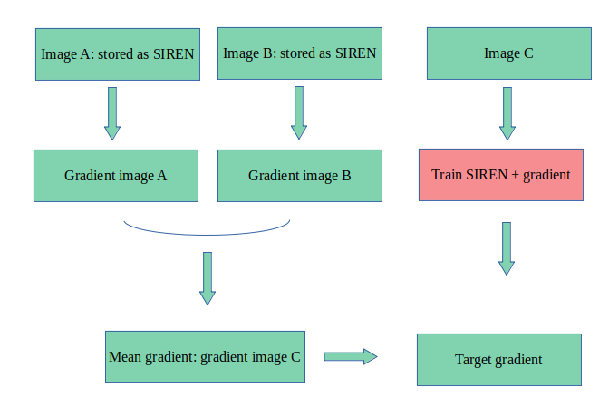
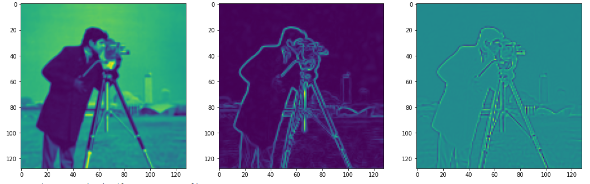
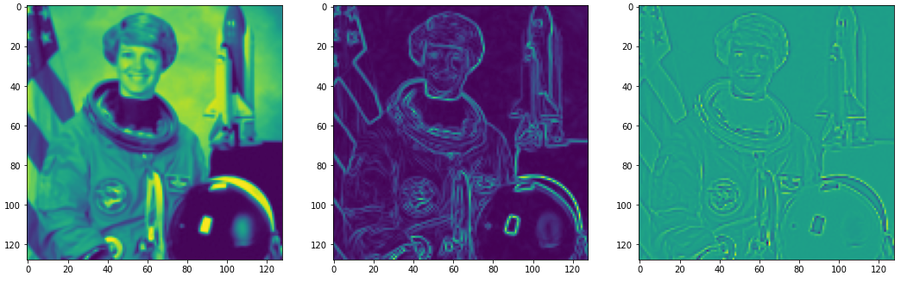
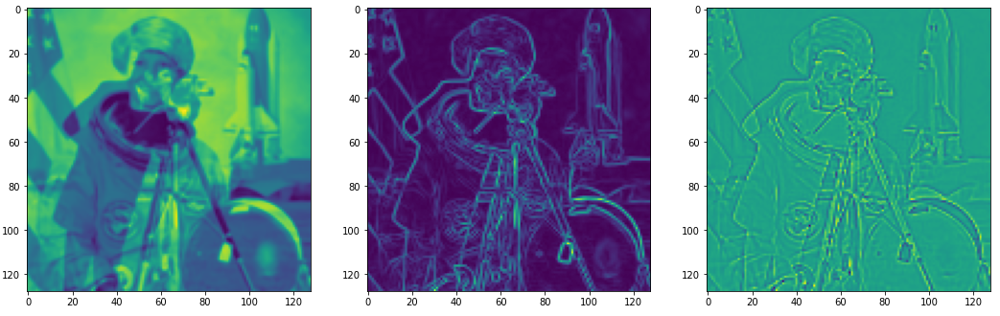

* Image merging *

The SIREN paper provides the example of an experiment in which SIREN networks are used to combine 2 images together. This notebook aims at reproducing this.

** Steps of transformation **

We consider image A and image B, we want to obtain image C as a mix of the 2 initial images. If we merge the images pixel by pixel, we will obtain new colors which we do not want. instead, we want only the main elements of each image to be present. Therefore, we are going to merge the gradients of the 2 images, and then build the image associated to this gradient. This operation does not require the use of SIREN networks. However, it is possible to use them as a storage format of each image.

** First test: merging 2 black and white images **

We take 2 images 128*128 in black and white and merge them together. The results for each image are:
- image outputted by SIREN model
- gradient off the output
- laplacian of the output

The images we show are image A, B, and C.

We see that the resulting image has the details of both images. Since the elements are in the same positions in each image, it results is transparent shapes.

** Second test: merging 2 colored images **

This time, the images have 3 channels for RGB encoding. Similar SIREN models are used each time. The gradient also has 3 channels. When looking at the result, the image is in blakc and white however: the 3 channels do not manage to collect specific data. Why?...
