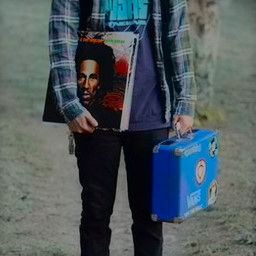

# First results

After messing around with the coloring model from https://medium.com/@emilwallner/colorize-b-w-photos-with-a-100-line-neural-network-53d9b4449f8d we eventually achieved something:
- 1000 epochs with only one picture to train and test

The initial photo

The result

*(!pip install tensorflow==1.14.0)*
*(!pip install keras==2.1.6)*
